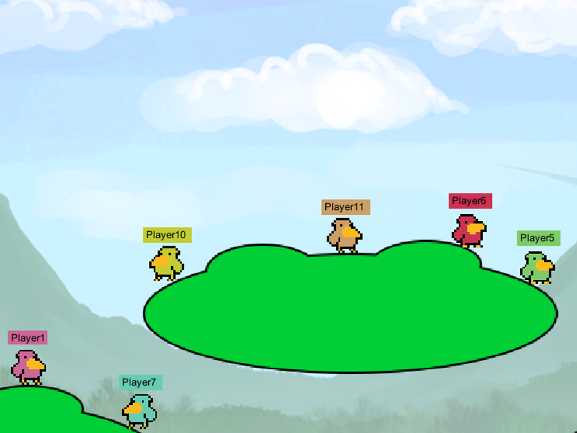

HFT-Unity 2D Platformer
=======================

This is a sample Unity3D game for the [HappyFunTimes party games system](http://greggman.github.io/HappyFunTimes).

It is basically [the 2D platformer example](https://unity3d.com/learn/tutorials/modules/beginner/2d) from the
unity website with HappyFunTimes control added.

Players that fall of the bottom or edges are respawn

